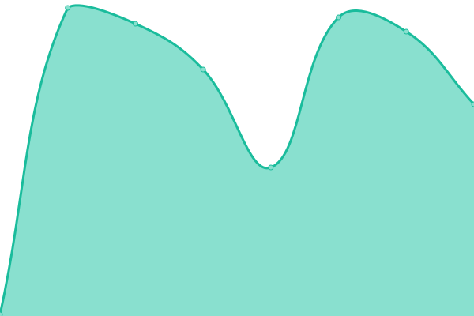

# [📈 Live Status](https://status.soiv-studio.xyz): <!--live status--> **🟧 Partial outage**

This repository contains the open-source uptime monitor and status page for [SOIV Studio](soiv-studio.xyz), powered by [Upptime](https://github.com/upptime/upptime).

With [Upptime](https://upptime.js.org), you can get your own unlimited and free uptime monitor and status page, powered entirely by a GitHub repository. We use [Issues](https://github.com/SOIV-Studio/status-page/issues) as incident reports, [Actions](https://github.com/SOIV-Studio/status-page/actions) as uptime monitors, and [Pages](https://status.soiv-studio.xyz) for the status page.

<!--start: status pages-->
<!-- This summary is generated by Upptime (https://github.com/upptime/upptime) -->
<!-- Do not edit this manually, your changes will be overwritten -->
<!-- prettier-ignore -->
| URL | Status | History | Response Time | Uptime |
| --- | ------ | ------- | ------------- | ------ |
|  [Main Website](https://soiv-studio.xyz) | 🟩 Up | [main-website.yml](https://github.com/SOIV-Studio/status-page/commits/HEAD/history/main-website.yml) | 

 175ms
     
 | 

<a href="https://status.soiv-studio.xyz/history/main-website">100.00%</a>
    

|  [Discord Bot Dashboard](https://dashboard.soiv-studio.xyz) | 🟩 Up | [discord-bot-dashboard.yml](https://github.com/SOIV-Studio/status-page/commits/HEAD/history/discord-bot-dashboard.yml) | 

 155ms
     
 | 

<a href="https://status.soiv-studio.xyz/history/discord-bot-dashboard">100.00%</a>
    

|  [Discord Bot API](https://bot-status.soiv-studio.xyz/health) | 🟥 Down | [discord-bot-api.yml](https://github.com/SOIV-Studio/status-page/commits/HEAD/history/discord-bot-api.yml) | 

 16794ms
     
 | 

<a href="https://status.soiv-studio.xyz/history/discord-bot-api">0.03%</a>
    

<!--end: status pages-->

## 📄 License

- Powered by: [Upptime](https://github.com/upptime/upptime)
- Code: [MIT](./LICENSE) © [SOIV-Studio](https://status.soiv-studio.xyz)
- Data in the `./history` directory: [Open Database License](https://opendatacommons.org/licenses/odbl/1-0/)
