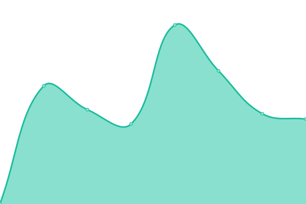
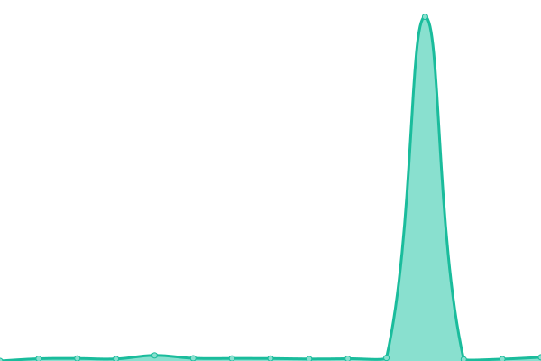

# [📈 Live Status](https://status.soiv-studio.xyz): <!--live status--> **🟧 Partial outage**

This repository contains the open-source uptime monitor and status page for [SOIV Studio](soiv-studio.xyz), powered by [Upptime](https://github.com/upptime/upptime).

With [Upptime](https://upptime.js.org), you can get your own unlimited and free uptime monitor and status page, powered entirely by a GitHub repository. We use [Issues](https://github.com/SOIV-Studio/status-page/issues) as incident reports, [Actions](https://github.com/SOIV-Studio/status-page/actions) as uptime monitors, and [Pages](https://status.soiv-studio.xyz) for the status page.

<!--start: status pages-->
<!-- This summary is generated by Upptime (https://github.com/upptime/upptime) -->
<!-- Do not edit this manually, your changes will be overwritten -->
<!-- prettier-ignore -->
| URL | Status | History | Response Time | Uptime |
| --- | ------ | ------- | ------------- | ------ |
|  [🌐 Main Website](https://soiv-studio.xyz) | 🟩 Up | [main-website.yml](https://github.com/SOIV-Studio/status-page/commits/HEAD/history/main-website.yml) | 

 196ms
     
 | 

<a href="https://status.soiv-studio.xyz/history/main-website">100.00%</a>
    

|  [📊 Dashboard](https://dashboard.soiv-studio.xyz) | 🟩 Up | [dashboard.yml](https://github.com/SOIV-Studio/status-page/commits/HEAD/history/dashboard.yml) | 

 203ms
     
 | 

<a href="https://status.soiv-studio.xyz/history/dashboard">100.00%</a>
    

|  [🤖 Discord Bot](https://bot-status.soiv-studio.xyz/health) | 🟥 Down | [discord-bot.yml](https://github.com/SOIV-Studio/status-page/commits/HEAD/history/discord-bot.yml) | 

 433ms
     
 | 

<a href="https://status.soiv-studio.xyz/history/discord-bot">0.00%</a>
    

|  [🔧 Backend API - Health Check](https://bot-api.soiv-studio.xyz/health) | 🟥 Down | [backend-api-health-check.yml](https://github.com/SOIV-Studio/status-page/commits/HEAD/history/backend-api-health-check.yml) | 

 2589ms
     
 | 

<a href="https://status.soiv-studio.xyz/history/backend-api-health-check">99.44%</a>
    

|  [🔧 Backend API - Auth Status](https://bot-api.soiv-studio.xyz/api/auth-status) | 🟩 Up | [backend-api-auth-status.yml](https://github.com/SOIV-Studio/status-page/commits/HEAD/history/backend-api-auth-status.yml) | 

 141ms
     
 | 

<a href="https://status.soiv-studio.xyz/history/backend-api-auth-status">99.78%</a>
    

|  [🔧 Backend API - DB Status](https://bot-api.soiv-studio.xyz/api/db-status) | 🟩 Up | [backend-api-db-status.yml](https://github.com/SOIV-Studio/status-page/commits/HEAD/history/backend-api-db-status.yml) | 

 105ms
     
 | 

<a href="https://status.soiv-studio.xyz/history/backend-api-db-status">99.79%</a>
    

|  [🎮 Discord OAuth Service](https://bot-api.soiv-studio.xyz/auth/discord) | 🟩 Up | [discord-o-auth-service.yml](https://github.com/SOIV-Studio/status-page/commits/HEAD/history/discord-o-auth-service.yml) | 

 367ms
     
 | 

<a href="https://status.soiv-studio.xyz/history/discord-o-auth-service">99.81%</a>
    

<!--end: status pages-->

## 📄 License

- Powered by: [Upptime](https://github.com/upptime/upptime)
- Code: [MIT](./LICENSE) © [SOIV-Studio](https://status.soiv-studio.xyz)
- Data in the `./history` directory: [Open Database License](https://opendatacommons.org/licenses/odbl/1-0/)
